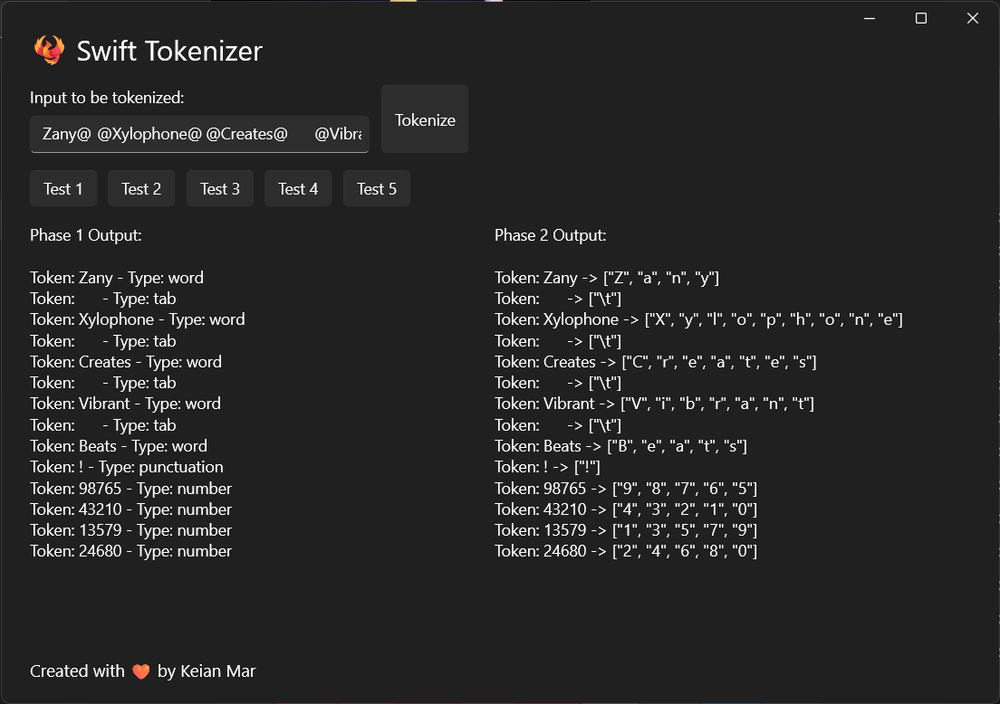

# 🐦‍🔥 Swift Tokenizer

A sample tokenizer written in Swift, with an accompanying UI using WinUI through [Swift-WinRT](https://github.com/thebrowsercompany/swift-winrt).

## Setup

### Building
1. [thebrowsercompany/swift-build](https://github.com/thebrowsercompany/swift-build/releases)
2. Visual Studio Community with C++ build tools
3. [Windows App Runtime SDK](https://github.com/thebrowsercompany/swift-windowsappsdk?tab=readme-ov-file#using-windows-app-sdk)

The build of the app is done through Swift Package Manager. This can be done on the command line with `swift build` or in Visual Studio Code with `Ctrl+Shift+B`.

## Credits
- [thebrowsercompany/windows-samples](https://github.com/thebrowsercompany/windows-samples)
    - This project was based on the WinUI3AnimationsPreview project by The Browser Company.
- [microsoft/WinUI-Gallery](https://github.com/microsoft/WinUI-Gallery)
- [Microsoft WinUI 3 API Documentation](https://learn.microsoft.com/en-us/windows/windows-app-sdk/api/winrt/)

## Author Information
- GitHub - [Keian Mar](https://github.com/7kei)